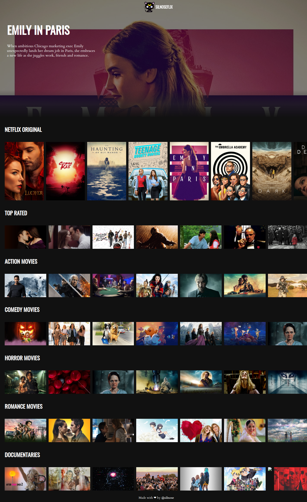

# Silnoseflix (Challenge 2hs)

My netflix clone.

- This project was bootstrapped with [Create React App](https://github.com/facebook/create-react-app).

## Scripts

- `npm install` install all the dependencies
- `npm run dev` Runs the app in the development mode - Open [http://localhost:3001](http://localhost:3001) to view it in the browser.
- `npm run build ` Builds the app for production to the `build` folder. 

## Licencia

MIT
